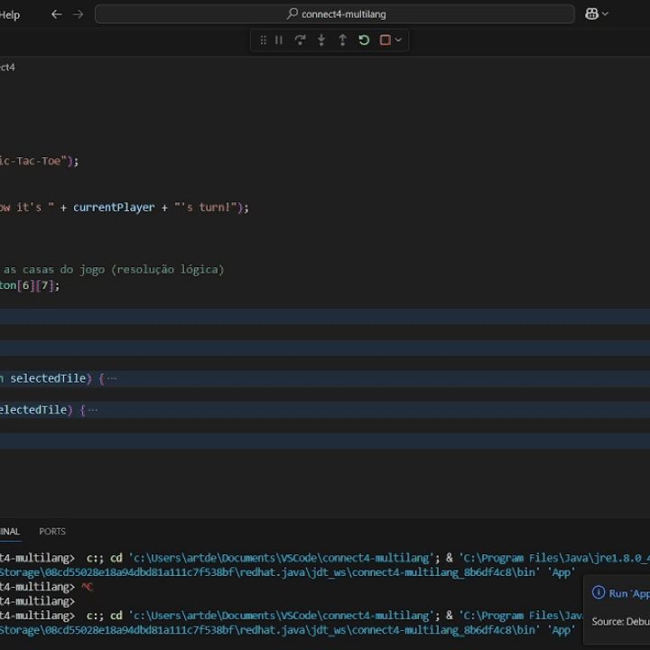

# Connect 4 Implementations in Various Programming Languages  
This repository contains implementations of the Connect 4 game in multiple programming languages.

## Demo (Java Implementation)  

## Implementations  
- **Java** (done)  
- **Python** (in progress)  
- **C++** (in progress)  

## Structure  
Each folder follows the naming pattern: `connect4-<language>`.  
Inside each folder, you will find the source code and instructions for running the Connect 4 implementation in that specific language.  
